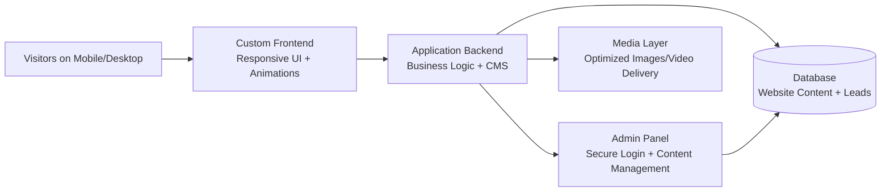
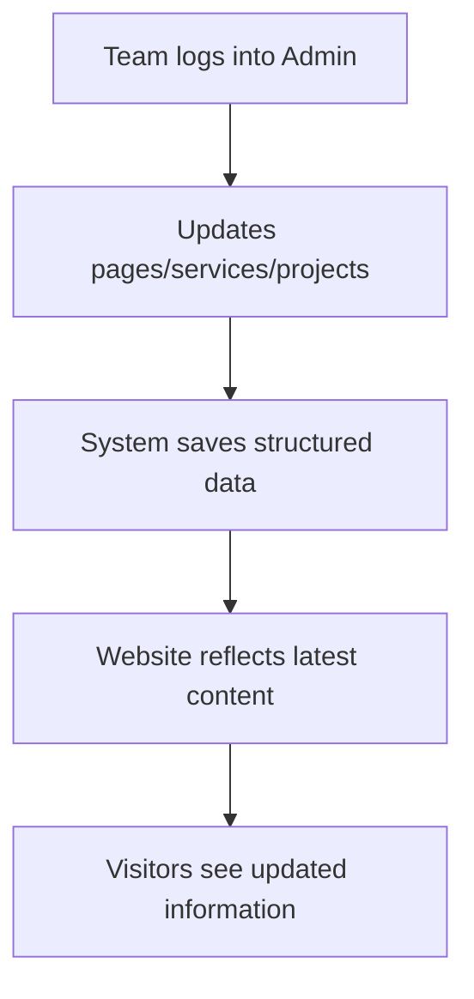

# Aanoukya Avenues Website Proposal

Creative Pitch Document (Non-Technical) + Pricing (INR)

Current reference website (Framer): `https://minimal-products-945796.framer.app/`

---

## 1) Proposal Objective

The goal is to create a premium, high-quality website experience that matches Aanoukya Avenues' brand positioning and works reliably for business growth.

This proposal recommends building the website using custom code from scratch instead of relying only on Framer for core implementation.

---

## 2) Why Framer-Only Is Not the Right Fit for This Requirement

Framer is excellent for quick visual prototyping. But for a premium business website that must grow over time, a Framer-only approach creates practical limits.

### In Simple Terms

- Framer helps create pages quickly, but deep control over animation quality is limited
- For growing business content (projects, services, updates), custom CMS structure is more flexible
- Technical SEO control is stronger in a custom build (including schema and deeper settings)
- Complex workflows and integrations are better when built natively in backend
- Framer projects often depend on multiple third-party tools for advanced needs
- As external tools increase, monthly cost and maintenance complexity also increase

### Why This Matters for Aanoukya Avenues

- You need high-quality motion and visual polish, not basic effects
- You need non-coding edit access for routine updates, with room to scale later
- You need freedom to add future features without platform restrictions

In short: Framer is fast for quick pages. A custom build is better for quality, control, and long-term growth.

---

## 3) Quick Comparison: Framer vs Custom Build

| Decision Area | Framer-Only Approach | Custom-Coded Approach (Proposed) |
|---|---|---|
| Animation quality | Good for basic interactions | Full control for premium cinematic motion |
| CMS flexibility | Best for simple pages/collections | Structured content with business-specific workflows |
| SEO depth | Basic controls | Full technical SEO control and extensibility |
| Integrations | Relies on third-party connectors | Direct backend integration support |
| Team workflows | Limited advanced permissions/publishing flow | Custom role and process control possible |
| Future scalability | Can become restrictive as needs grow | Built for feature expansion and long-term ownership |
| Long-term cost control | Can increase with add-ons | Better control over platform and feature costs |

Plain-English takeaway: Framer is fast for visual landing pages, but a custom build is better for long-term quality, control, and growth.

---

## 4) Proposed Solution: Custom-Coded Website (From Scratch)

### What Will Be Built

- Fully custom responsive website (desktop + mobile)
- Premium visual style with smooth animations and polished interactions
- Structured sections for services, projects, team, and contact flow
- Secure admin panel for non-coding content updates
- SEO-ready technical setup for better discoverability

### Business Benefits

- Better quality control over design, speed, and animation
- Better long-term scalability as business needs grow
- Better control over content, SEO, and integrations
- Full ownership of code and data

---

## 5) Proposed High-Level Architecture

---

## 6) Proposed Content Management Flow

---

## 7) Scope of Work (Initial)

- Home page
- About page
- Services (list + detail)
- Projects (list + detail)
- Contact page
- Admin content management setup
- Basic SEO implementation
- Deployment and hosting setup

---

## 8) Detailed Feature Set (What You Get)

### A) Website Pages Included in Initial Scope

- Home page: brand-first hero, service highlights, featured projects, social proof, and clear CTA
- About page: company story, positioning, leadership and trust-building content
- Services module: service listing page + individual service detail pages
- Projects module: project listing page + individual project detail pages
- Contact page: inquiry form, validation, and business contact details

### B) Premium Frontend Experience (Quality Layer)

- Cinematic first-load branded entry sequence
- Smooth page transitions between internal pages
- Scroll-triggered reveal animations for key sections
- Animated number counters for achievements/stats
- Visual depth effects (parallax style movement)
- Gallery motion effects and premium hover interactions
- Mobile-first responsive behavior across devices
- Consistent typography, spacing, and visual hierarchy for high-end brand feel

### C) Admin Features for Non-Coding Team

- Secure admin login and protected dashboard
- Services management: add/edit/delete and reorder content
- Projects management: add/edit/delete, manage details, and manage project images
- Team management: add/edit/delete member profiles
- Testimonials management: add/edit/delete social proof entries
- Site content management: update key text blocks and section content without coding
- Contact inbox management: view inquiries and track response status
- User management: create and manage admin users (access controlled)

### D) SEO and Discovery Features

- SEO-ready page structure for better indexing
- Editable titles/descriptions for better search appearance
- Structured metadata support for richer search visibility
- Social sharing metadata setup (link previews)
- Clean URL structure and crawl-friendly layout

### E) Performance, Reliability, and Security

- Optimized frontend delivery for faster page loads
- Media delivery designed for web performance
- Responsive optimization for mobile and desktop consistency
- Branded fallback error pages for trust continuity
- Form validation and secure request handling
- Role-protected admin routes and standard web security practices

### F) What Team Can Edit Without Developer

- Text updates across pages
- Replace/update existing images
- Add new service entries
- Add new project entries
- Update team and testimonial content
- Manage incoming contact leads

### G) What Is Treated as Change Request

- New custom section design not part of initial approved scope
- New page template/layout addition
- New feature/module/integration request
- Advanced workflow or automation setup

Routine content updates are easy from admin. Structural additions and new feature development are billed as change requests (industry standard, including Framer workflows).

### H) Feature-by-Feature Delivery Snapshot

| Feature Area | What Is Included | Business Benefit |
|---|---|---|
| Hero experience | Full-width visual hero with premium motion treatment | Strong first impression and brand positioning |
| Loader and transitions | Branded entry loader + smooth page transitions | Premium feel across the complete journey |
| Scroll interactions | Reveal animations, movement depth effects, and hover interactions | Better engagement and modern browsing experience |
| Stats and highlights | Animated stat counters and visual proof blocks | Builds trust quickly for first-time visitors |
| Services and projects | Listing + detail page structure for both modules | Clear service communication and portfolio storytelling |
| Testimonials and team | Structured social proof and team credibility sections | Improves conversion confidence |
| Contact flow | Validated inquiry form + lead capture workflow | Better lead quality and faster response process |
| Admin CMS | Non-coding panel to update content/images and manage entries | Team can maintain site without developer dependency for routine edits |
| User access control | Protected admin routes and managed user access | Safer operations for internal team |
| SEO setup | Meta setup, social share setup, and technical SEO base | Better discoverability and cleaner link previews |
| Reliability layer | Branded fallback pages and production-ready setup | Professional behavior even during unexpected errors |
| Responsive quality | Mobile, tablet, and desktop optimized layout behavior | Consistent brand experience across devices |

---

## 9) Pricing and Commercials (INR)

### Total Project Price

The proposed cost for the initial agreed scope is **Rs. 30,000** (one-time).

### Price Breakdown (Included in Rs. 30,000)

| Component | Price (INR) |
|---|---:|
| Planning + page flow | 3,000 |
| UI styling | 6,000 |
| Frontend development + animations | 8,000 |
| Backend/CMS setup | 8,000 |
| SEO basics + testing + deployment (Does not cover platform charges) | 5,000 |
| **Total** | **30,000** |

Platform charges (hosting, domain, paid third-party tools/services) are billed separately and are not included in the Rs. 30,000 development fee.

### Component-Wise Deliverables (So Scope Is Clear)

| Component | What This Covers |
|---|---|
| Planning + page flow | Final sitemap, page sequencing, section planning, CTA flow |
| UI styling | Brand-aligned visual direction, layout styling, spacing, typography, color system |
| Frontend development + animations | Responsive page build, transitions, interactions, animation implementation |
| Backend/CMS setup | Admin panel setup, editable content structure, content entity management |
| SEO basics + testing + deployment | Basic on-page SEO setup, cross-device QA, go-live setup, smoke testing |

### Commercial Inclusion/Exclusion Snapshot

- Included: initial agreed website scope, implementation, go-live setup, and 2 months minor support
- Excluded: platform charges, paid external tools, advanced integrations, and any post-approval scope expansion

### Payment Milestones

| Milestone | Amount (INR) |
|---|---:|
| Booking advance (project kickoff) | 15,000 (50%) |
| After design/development preview approval | 9,000 (30%) |
| Before final go-live handover | 6,000 (20%) |

### Hosting and Running Cost

| Item | Price (INR) |
|---|---:|
| Hosting | **Rs. 400 - Rs. 500 / month** |
| Domain renewal (if applicable) | At actuals (paid by client) |
| Paid plugins/services (if requested) | At actuals (paid by client) |

### Support Terms

| Period | Cost |
|---|---:|
| First 2 months after go-live | **Free Support** |
| After free period | Charged as per request scope |

### Change Request Pricing (Outside Initial Scope)

| Change Type | Commercial Range (INR) |
|---|---:|
| New standard section on existing page | 1,500 - 3,500 |
| New standard page (content-led) | 2,500 - 5,000 |
| Advanced custom section/page | 5,000+ |
| New feature/module/integration | Quote after requirement review |

Note: Final change request amount depends on complexity, revision count, and turnaround expectation.

---

## 10) Estimated Timeline

The project can be delivered in **7 to 10 working days** from the date all required content and assets are shared.

### Timeline Breakdown

| Phase | Duration | Notes |
|---|---:|---|
| Content and asset handover | 3-5 working days | Shared by client |
| Build, content integration, and styling | 3-4 working days | Development + refinement |
| Review, feedback, and final polish | 1-2 working days | Includes minor revisions |
| Go-live and closure | 1 working day | Final deployment |

### Timeline Dependency

Any delay in sharing content/assets or consolidated feedback may extend the timeline accordingly.

---

## 11) Client Inputs Required (To Avoid Delays)

To maintain the timeline and pricing, the following must be shared by the client:

- Final text content for each page
- Images/videos/logo/brand assets in best available quality
- Project details (titles, descriptions, locations, service tags)
- Team member details and profile images
- Final approvals in consolidated form

### Approval Process (Recommended)

- Step 1: Share complete content and assets
- Step 2: Receive first implementation preview
- Step 3: Share one consolidated feedback list
- Step 4: Final refinements and approval
- Step 5: Go-live and support handover

Using consolidated feedback helps keep cost and timeline predictable.

---

## 12) Commercial Clarifications

The above quotation covers the initial agreed website scope. Any additional pages, new feature requests, advanced integrations, or major revisions will be estimated separately and taken up after approval.

All website content and assets (text, images, videos, logos, project data, and brand documents) must be provided by the client. Accuracy, ownership, and usage rights for provided content/assets remain the client's responsibility.

This proposal includes standard implementation and reasonable refinements. Major redesigns after approval, repeated scope changes, or delayed consolidated feedback may impact timeline and commercials.

### Not Included in Initial Quote (Unless Added as CR)

- Content writing/copywriting
- Professional photography or videography
- Paid stock assets/licenses
- Paid third-party platform subscriptions
- Advanced custom integrations (CRM, ERP, payment gateways, etc.)
- Ongoing monthly maintenance beyond free support window

---

## 13) Quick FAQ (No Ambiguity)

### Can non-coding team members edit the website?

Yes. Day-to-day updates like text edits, image replacements, and updating projects/services/testimonials can be handled from the admin panel without coding.

### Can your team add totally new sections/pages anytime?

Yes, but new sections/pages are outside routine content editing and are treated as change requests with separate costing.

### Is this different from Framer in practice?

Yes. Framer also needs operator skill for layout, responsiveness, and animation quality. The proposed custom setup gives better long-term flexibility and fewer platform constraints.

### Who provides content and assets?

Client provides final text, images, videos, logos, and project details. Accuracy, ownership, and usage rights remain with the client.

### When does timeline start?

Timeline starts after complete content and assets are shared.

### What is included in free support?

Minor fixes, guidance, and small adjustments for 2 months after go-live. New pages/features and major redesign requests are billed separately.

---

## 14) Suggested Pitch Line

"To achieve the quality and control your brand needs, I recommend building your website through custom code from scratch, not only through Framer. This gives you better animation quality, long-term flexibility, and a strong business-ready foundation at Rs. 30,000, with low monthly hosting and 2 months of free support."
